# Bank Platform

---?image=assets/gifs/charlie.gif
---?image=assets/gifs/ballmer.gif
---?image=assets/gifs/charlie.gif
---?image=assets/gifs/ballmer.gif
---

## Darion Miller or John Denver?
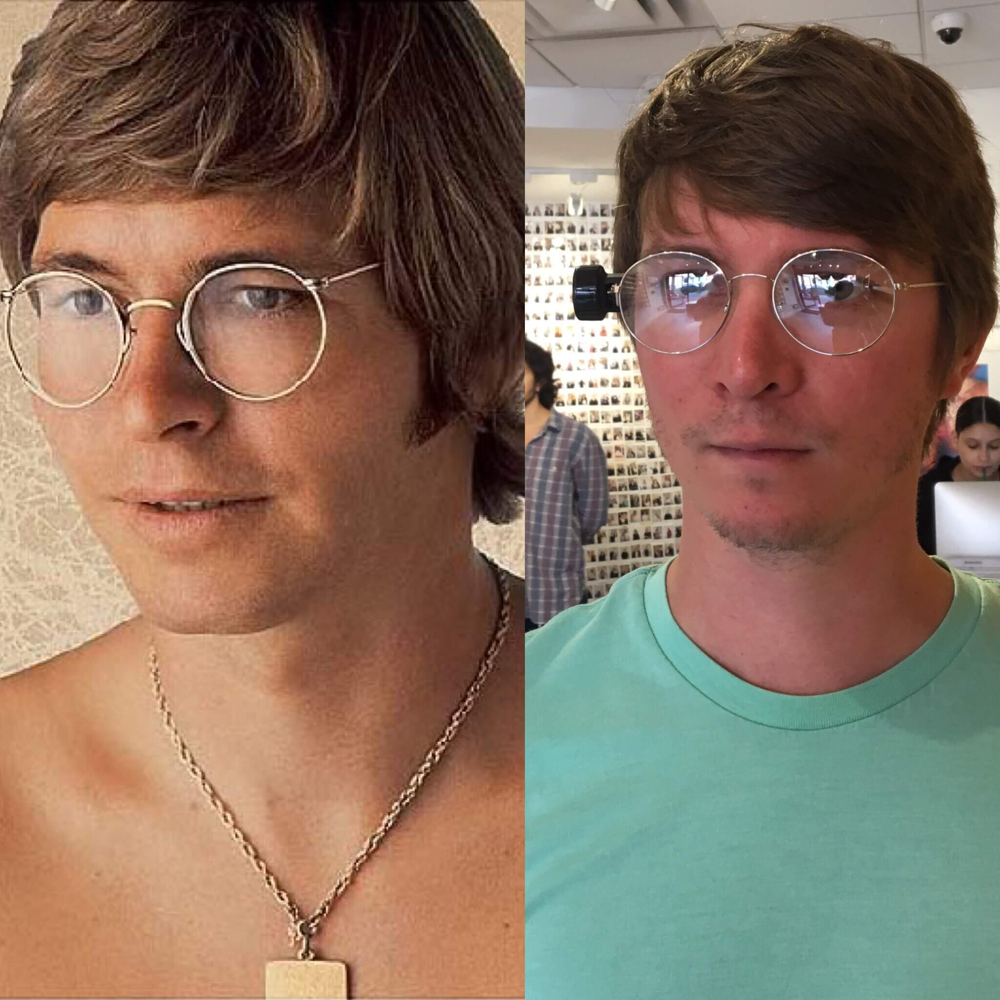
---

## DM or JD?

---

@snap[west]

@snapend

@snap[east]
@size[1.5em](Darion Miller)
@snapend
---

## DM or JD?

---

@snap[west]

@snapend

@snap[east]
@size[1.5em](Darion Miller)
@snapend
---

## DM or JD?

---

@snap[west]

@snapend

@snap[east]
@size[1.5em](Darion Miller)
@snapend
---

## Agenda

* Data and such

* Bank platform

---?image=assets/gifs/charlie.gif
---

## Data
---

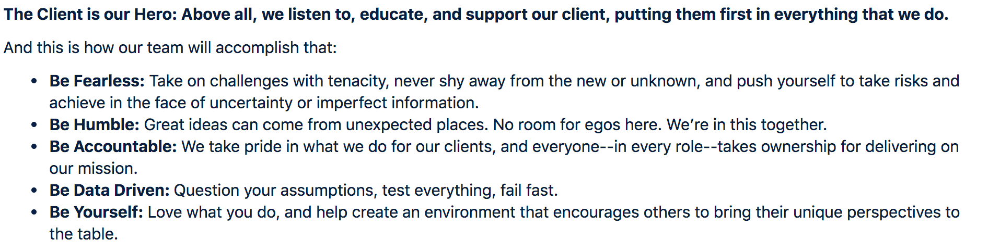
---

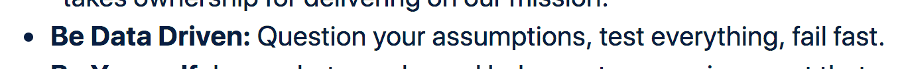
---

---

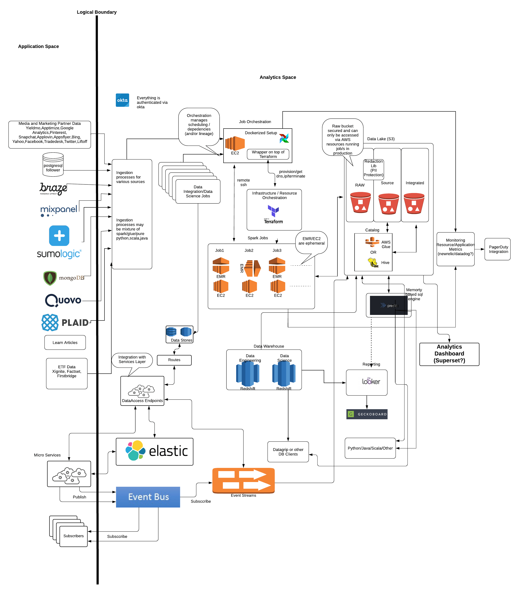
---

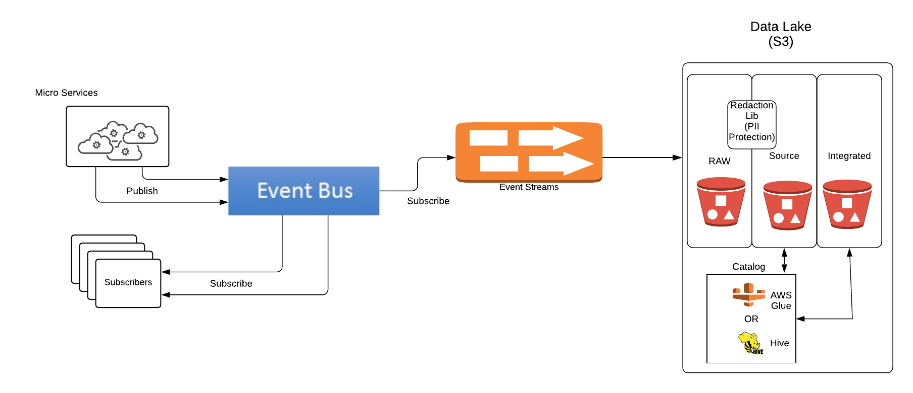
---

---

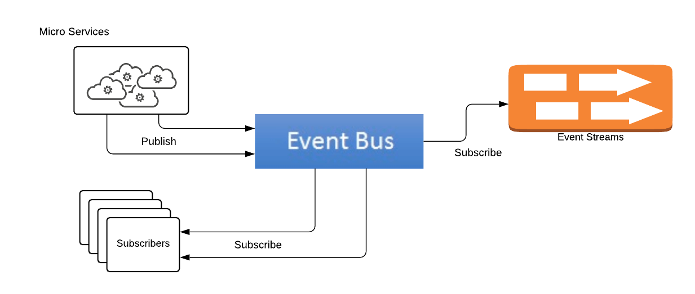

---?image=assets/gifs/ballmer.gif
---

## DM or JD?

---

@snap[west]

@snapend

@snap[east]
@size[1.5em](John Denver)
@snapend
---

## DM or JD?

---

@snap[west]

@snapend

@snap[east]
@size[1.5em](Darion Miller)
@snapend

---?image=assets/gifs/charlie.gif
---

## Some random words

@ul
- Green Dot ✅
- We're not really the source of truth for anything
- API Calls + Events
@ulend
---

### Service View
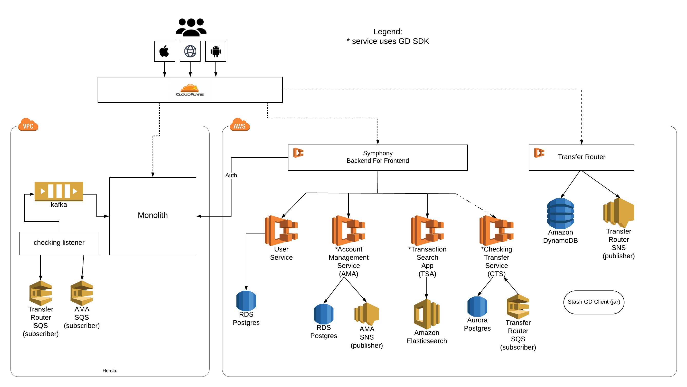
---

### Webhooks
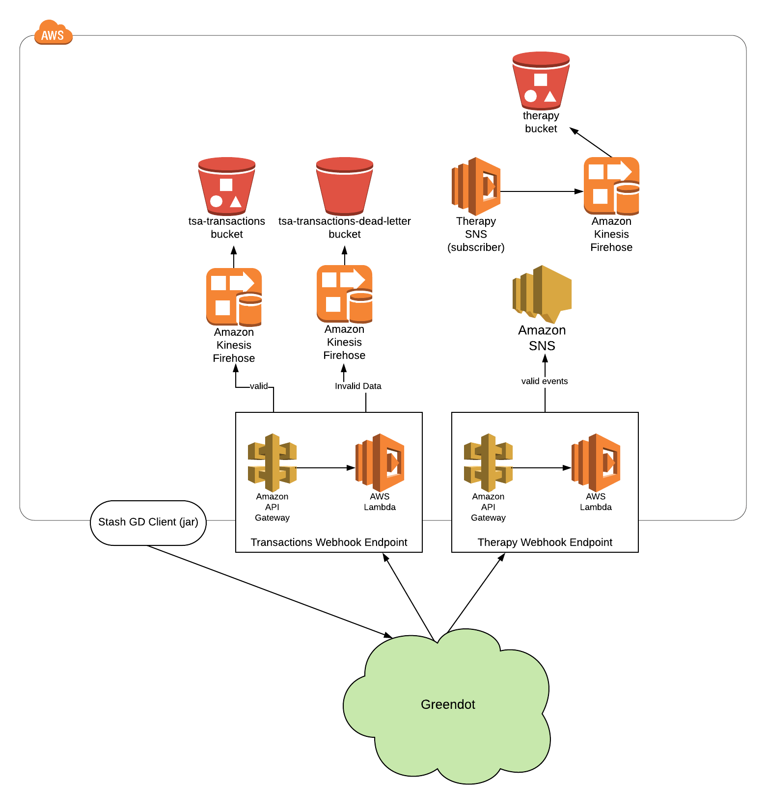
---

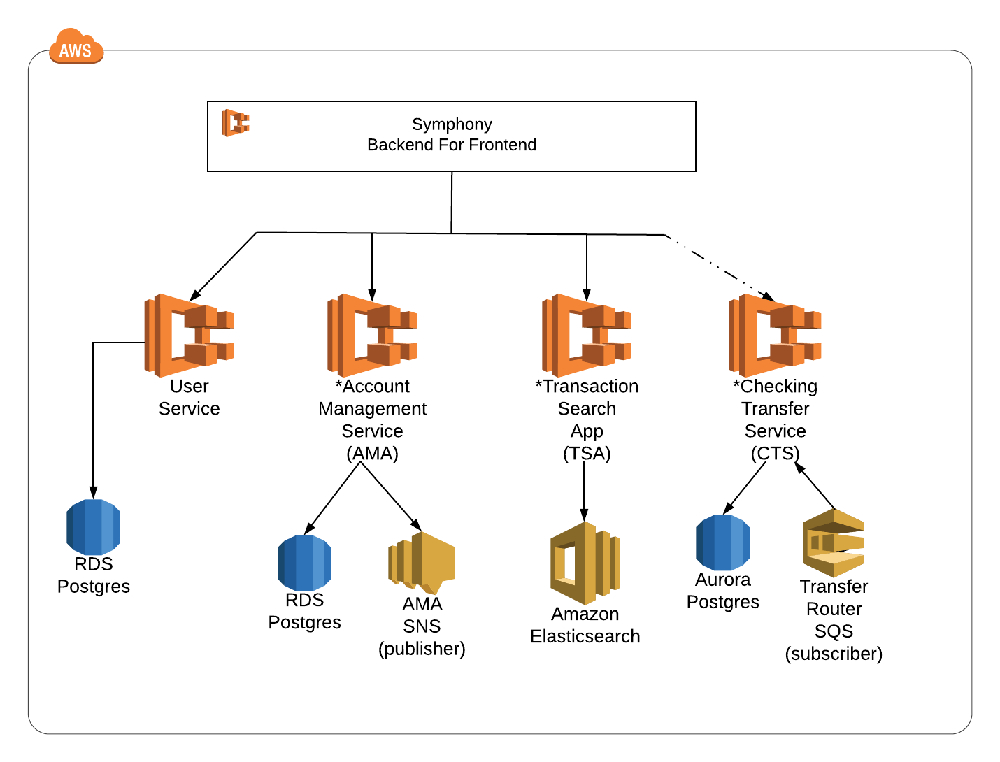
---
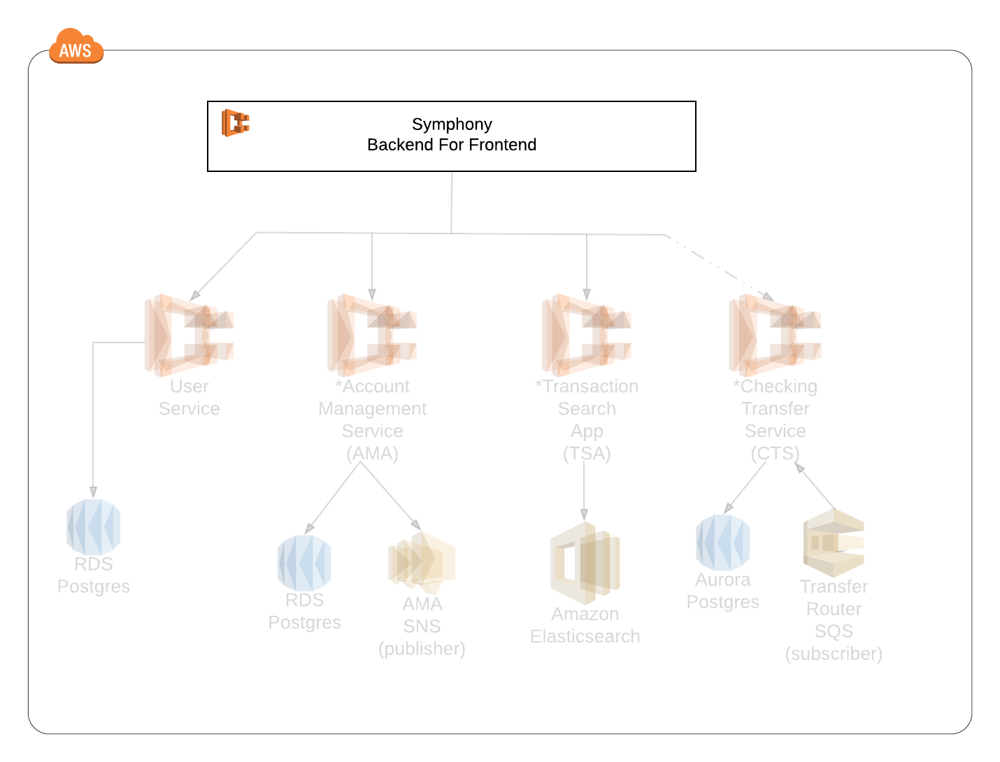
---
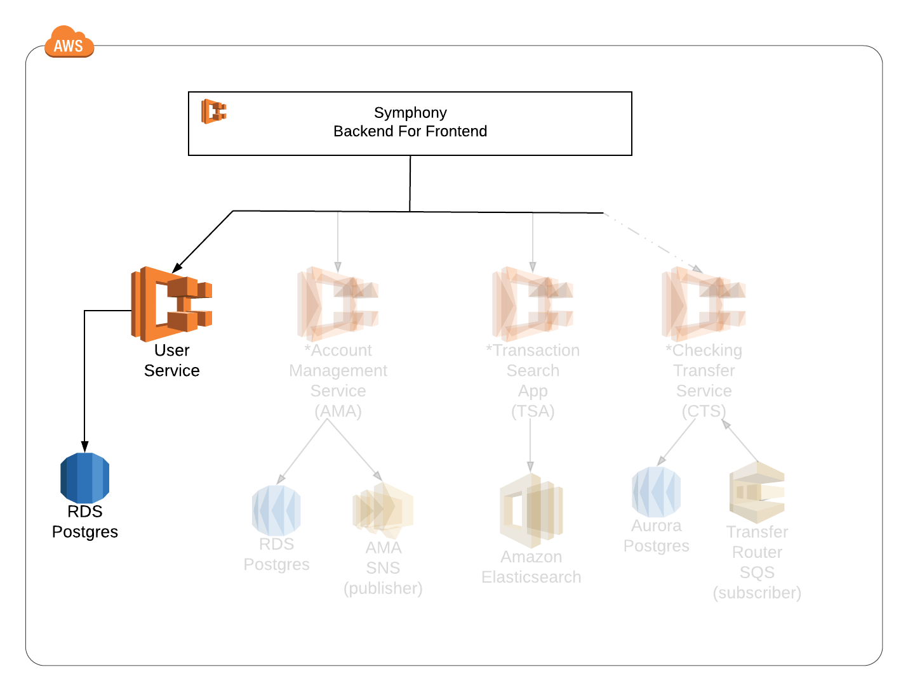
---
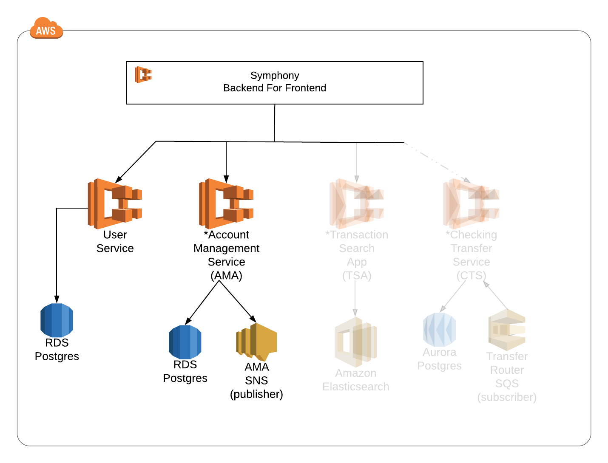
---
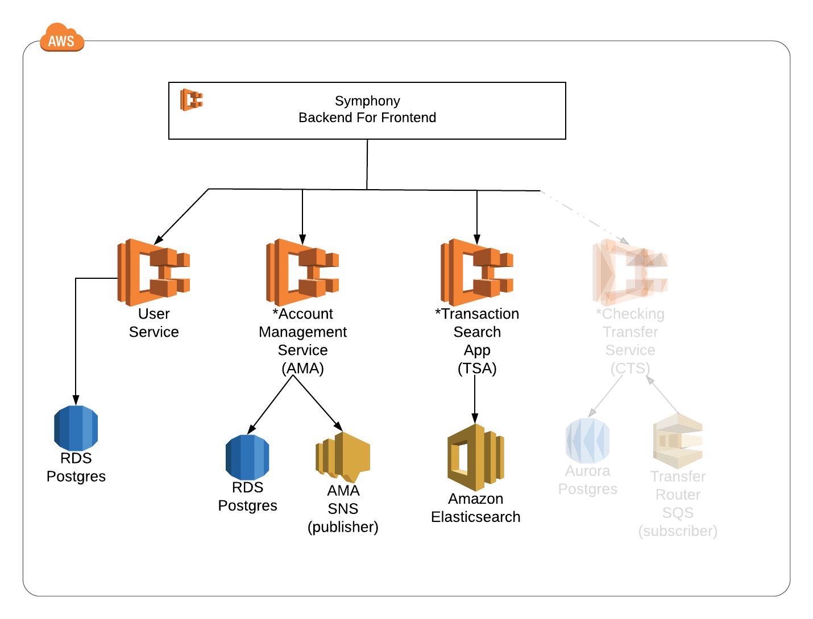
---

---

---

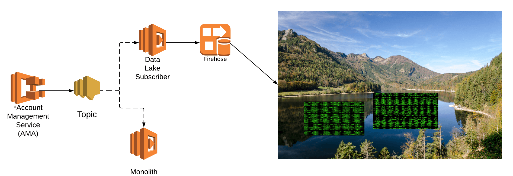
---
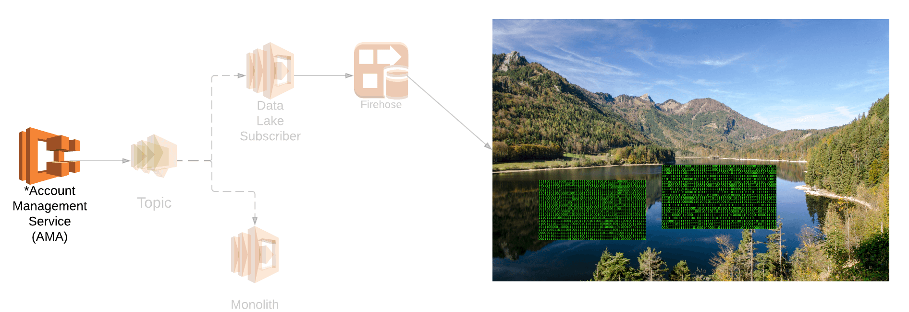
---
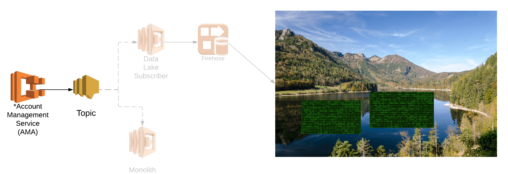
---
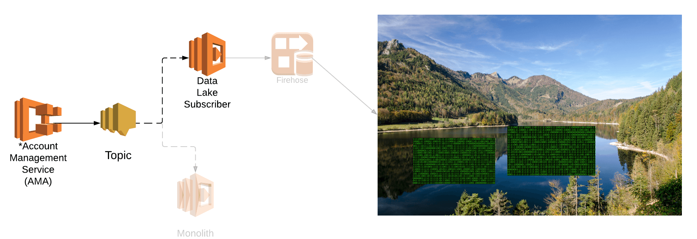
---
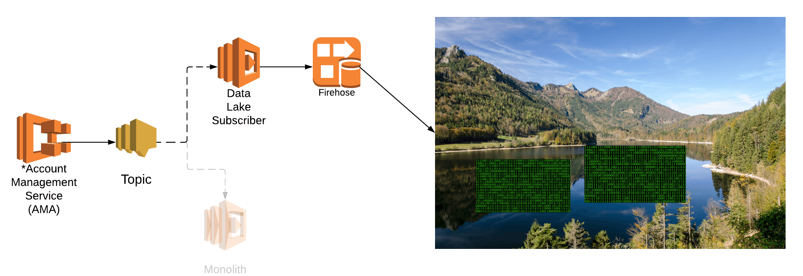
---

---

---?image=assets/gifs/ballmer.gif
---

## DM or JD?

---

@snap[west]

@snapend

@snap[east]
@size[1.5em](Darion Miller)
@snapend
---

## DM or JD?

---

@snap[west]

@snapend

@snap[east]
@size[1.5em](Darion Miller)
@snapend
---

## Questions

😬
